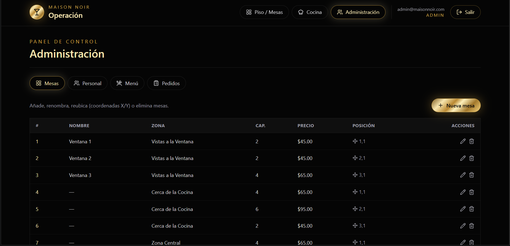

# Maison Noir · Sistema de Operación de Restaurante

Hecho por: Alejandro Rodríguez Duque
Fecha: 10/07/2026
Utilizado con Claude.

Aplicación full‑stack para operar un restaurante: los **meseros** reportan por mesa qué platos se
piden, los **cocineros** ven la cola de cocina con la receta fija de cada plato (proteína,
condimentos, ingredientes) y marcan cada plato como listo, y el **administrador** gestiona mesas,
personal, menú y pedidos.

- **Backend:** Kotlin + Spring Boot 3.2, JPA/Hibernate, PostgreSQL, seguridad JWT (RBAC).
- **Frontend:** React 19 + Vite + Tailwind CSS + React Router.

---

## Roles

| Rol                         | Ruta      | Qué puede hacer                                                                                                                                                   |
| --------------------------- | --------- | ----------------------------------------------------------------------------------------------------------------------------------------------------------------- |
| **Administrador** (`ADMIN`) | `/admin`  | CRUD de mesas (incluye mover por coordenadas), personal (meseros y cocineros), menú con receta, y resumen de pedidos.                                             |
| **Mesero** (`EMPLOYEE`)     | `/piso`   | Ver el mapa de mesas y tomar pedidos por mesa eligiendo platos del menú; enviarlos a cocina.                                                                      |
| **Cocinero** (`COOK`)       | `/cocina` | Ver la cola de platos pendientes con su receta y marcar cada plato como _Preparando_ / _Listo_. Al quedar todos los platos listos, el pedido pasa a _Completado_. |

Los platos del menú **no son personalizables**: su receta (proteína, condimentos, ingredientes,
notas de preparación) se define una vez y el cocinero la consulta desde la cola.

---

## Requisitos previos

- **JDK 21** (obligatorio — Gradle 8.6 no funciona con JDK 24/25).
- **PostgreSQL 14+** corriendo en `localhost:5432`.
- **Node.js 18+** (incluye Corepack para usar `pnpm` sin instalarlo aparte).

---

## Descarga e instalación

```bash
# 1. Clonar el repositorio
git clone <URL-del-repositorio>
cd reservas
```

### 2. Base de datos

Crea la base de datos en PostgreSQL:

```sql
CREATE DATABASE restaurant_reservations;
```

Si tu usuario/contraseña no son `postgres` / `postgres`, edítalos en
`src/main/resources/application.yml`:

```yaml
spring:
  datasource:
    url: jdbc:postgresql://localhost:5432/restaurant_reservations
    username: postgres
    password: postgres
```

El esquema se crea solo (`ddl-auto: update`) y al primer arranque se **siembran datos de demo**
(un restaurante, mesas, menú con recetas y usuarios).

### 3. Backend (Kotlin / Spring Boot)

`gradle.properties` apunta a un JDK 21 en `C:/Program Files/Java/jdk-21`. Si tu JDK 21 está en otra
ruta, ajústala ahí (o borra esa línea y usa `JAVA_HOME` apuntando a un JDK 21).

```powershell
# Windows (PowerShell) — el prefijo .\ es obligatorio
.\gradlew.bat bootRun
```

El backend queda en `http://localhost:8081`.

> Se usa el **8081** (y no el 8080) para no chocar con Apache de XAMPP/WAMP, que suele ocupar el 8080. Así puedes dejar XAMPP encendido. Si el 8081 también estuviera ocupado, cámbialo en
> `src/main/resources/application.yml` (`server.port`) y en el proxy de `site_web/vite.config.js`.

### 4. Frontend (React / Vite)

```bash
cd site_web
corepack pnpm install
corepack pnpm dev
```

Abre `http://localhost:5173`. El servidor de Vite hace _proxy_ de `/api` hacia el backend en
`http://localhost:8081`.

---

## Cuentas de demostración

Todas usan la contraseña **`password123`**:

| Rol           | Correo                                              |
| ------------- | --------------------------------------------------- |
| Administrador | `admin@maisonnoir.com`                              |
| Mesero        | `mesero1@maisonnoir.com` · `mesero2@maisonnoir.com` |
| Cocinero      | `cocina1@maisonnoir.com` · `cocina2@maisonnoir.com` |

En la pantalla de login hay botones para rellenar estas credenciales rápidamente.

---

## Solución de problemas

- **`Port 8081 was already in use`**: cambia `server.port` en `src/main/resources/application.yml`
  a un puerto libre y actualiza el destino del proxy en `site_web/vite.config.js` para que coincida.
- **`Java home ... is invalid` / la build falla al arrancar**: falta JDK 21 o la ruta de
  `gradle.properties` no coincide con tu instalación. Corrige `org.gradle.java.home`.
- **`violates check constraint "users_role_check"`**: tu base de datos viene de una versión anterior
  sin el rol `COOK`. Elimina el constraint obsoleto (una sola vez):
  `ALTER TABLE users DROP CONSTRAINT IF EXISTS users_role_check;`
  o recrea la base de datos vacía.

---

## Estructura del proyecto

```
reservas/
├── src/main/kotlin/com/restaurant/reservations/
│   ├── controller/   # Controladores REST (auth, tables, orders, cook, menu, staff, admin)
│   ├── dto/          # Objetos de transferencia
│   ├── model/        # Entidades (User, Restaurant, Zone, Table, Order, OrderItem, MenuItem)
│   ├── repository/   # Repositorios JPA
│   ├── security/     # JWT + configuración de seguridad
│   ├── service/      # Lógica de negocio
│   └── config/       # DataSeeder (datos de demo), CORS
├── src/main/resources/application.yml
├── site_web/         # Frontend React (Vite + Tailwind)
│   └── src/
│       ├── api/          # Cliente HTTP y módulos por recurso
│       ├── auth/         # Contexto de autenticación (JWT)
│       ├── components/   # UI reutilizable y paneles de admin
│       ├── pages/        # Login, Piso, Cocina, Administración
│       └── utils/
├── build.gradle.kts
├── gradle.properties     # JDK usado por Gradle (JDK 21)
└── README.md
```

---

## Principales endpoints de la API

| Método              | Ruta                                             | Rol            | Descripción                              |
| ------------------- | ------------------------------------------------ | -------------- | ---------------------------------------- |
| POST                | `/api/auth/login`                                | público        | Iniciar sesión, devuelve el JWT          |
| GET                 | `/api/staff/tables`                              | staff          | Mesas del restaurante                    |
| GET                 | `/api/staff/menu`                                | staff          | Menú con receta                          |
| POST                | `/api/employee/orders`                           | mesero/admin   | Crear pedido para una mesa               |
| GET                 | `/api/employee/tables/{id}/orders`               | mesero/admin   | Pedidos de una mesa                      |
| GET                 | `/api/cook/queue`                                | cocinero/admin | Cola de platos por preparar (con receta) |
| PUT                 | `/api/cook/order-items/{id}/status?status=READY` | cocinero/admin | Marcar plato listo                       |
| GET/POST/PUT/DELETE | `/api/admin/staff[/{id}]`                        | admin          | CRUD de personal                         |
| GET/POST/PUT/DELETE | `/api/admin/menu[/{id}]`                         | admin          | CRUD de menú                             |
| POST/PUT/DELETE     | `/api/employee/tables[/{id}]`                    | admin/mesero   | Crear, mover y eliminar mesas            |
| GET                 | `/api/admin/orders`                              | admin          | Todos los pedidos                        |

---

## Seguridad

- Autenticación con **JWT** (algoritmo HS512).
- Control de acceso por rol (RBAC) en cada endpoint.
- Contraseñas cifradas con **BCrypt**.

## Licencia

Copyright © 2026. Todos los derechos reservados.
