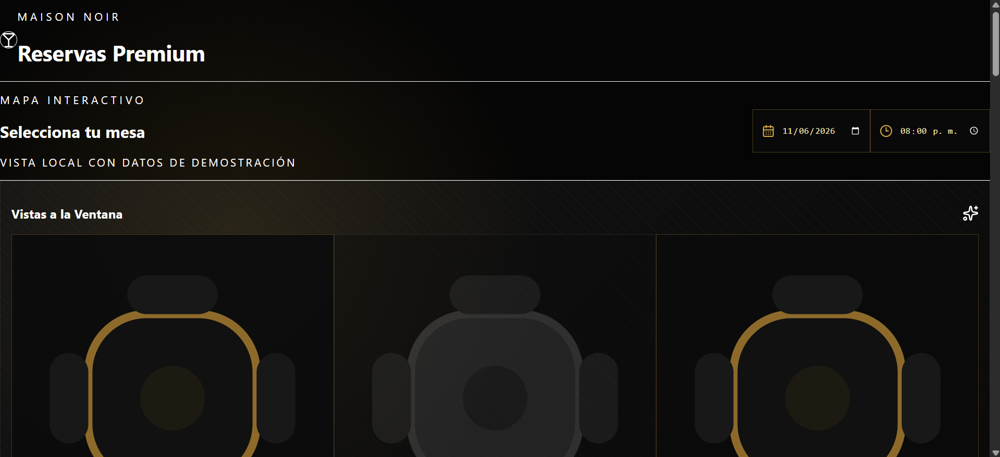

# Restaurant Reservations Platform 1.0.0v

A multi-tenant restaurant reservation system built with Kotlin and Spring Boot, similar to Rappi but with automatic website generation for each restaurant.

## Features

### Multi-Restaurant Platform

- Any restaurant can register and get their own reservation system
- Automatic website generation for each restaurant upon registration
- Customizable tables, chairs, and floors configuration

### Three User Roles

#### Administrator

- Full CRUD on all reservations and active orders
- Restaurant registration and management
- User management within the restaurant

#### Employee

- CRUD on orders
- Table management
- Order status updates

#### Customer

- CRUD on tables (view)
- Create reservations with price, quantity of guests
- View order history

### Two Modes

- **Website Mode**: Customers can reserve tables through the restaurant's generated website
- **App Mode (Employee)**: Employees can take orders for each table and chair

## Tech Stack

- **Language**: Kotlin
- **Framework**: Spring Boot 3.2.0
- **Database**: PostgreSQL
- **Security**: JWT Authentication
- **Build Tool**: Gradle with Kotlin DSL

## Project Structure

```
reservas/
├── src/
│   └── main/
│       ├── kotlin/com/restaurant/reservations/
│       │   ├── controller/      # REST API controllers
│       │   ├── dto/            # Data Transfer Objects
│       │   ├── model/          # Domain entities
│       │   ├── repository/     # JPA repositories
│       │   ├── security/       # JWT and security configuration
│       │   └── service/        # Business logic
│       └── resources/
│           └── application.yml # Application configuration
├── build.gradle.kts            # Gradle build configuration
├── settings.gradle.kts         # Gradle settings
└── README.md
```

## Setup Instructions

### Prerequisites

- Java 17 or higher
- PostgreSQL database
- Gradle 8.0 or higher

### Database Setup

1. Create a PostgreSQL database:

```sql
CREATE DATABASE restaurant_reservations;
```

2. Update database credentials in `src/main/resources/application.yml`:

```yaml
spring:
  datasource:
    url: jdbc:postgresql://localhost:5432/restaurant_reservations
    username: your_username
    password: your_password
```

### Build and Run

1. Build the project:

```bash
./gradlew build
```

2. Run the application:

```bash
./gradlew bootRun
```

The application will start on `http://localhost:8080`

## API Endpoints

### Authentication

- `POST /api/auth/register` - Register a new user
- `POST /api/auth/login` - Login and get JWT token

### Public Endpoints

- `GET /api/public/restaurants` - Get all active restaurants
- `GET /api/public/restaurants/{slug}` - Get restaurant by slug
- `GET /api/public/restaurants/{slug}/tables` - Get restaurant tables

### Admin Endpoints (Role: ADMIN)

- `POST /api/admin/restaurants/register` - Register a new restaurant
- `GET /api/admin/restaurants` - Get all restaurants
- `GET /api/admin/reservations` - Get all reservations
- `GET /api/admin/orders` - Get all orders
- `GET /api/admin/orders/active` - Get active orders

### Employee Endpoints (Role: EMPLOYEE, ADMIN)

- `POST /api/employee/tables` - Create a table
- `GET /api/employee/tables/{id}` - Get table by ID
- `PUT /api/employee/tables/{id}` - Update table
- `DELETE /api/employee/tables/{id}` - Delete table
- `POST /api/employee/orders` - Create an order
- `GET /api/employee/orders` - Get employee's orders
- `PUT /api/employee/orders/{id}/status` - Update order status

### Customer Endpoints (Role: CUSTOMER, EMPLOYEE, ADMIN)

- `POST /api/customer/reservations` - Create a reservation
- `GET /api/customer/reservations` - Get customer's reservations
- `PUT /api/customer/reservations/{id}` - Update reservation
- `PUT /api/customer/reservations/{id}/confirm` - Confirm reservation
- `PUT /api/customer/reservations/{id}/cancel` - Cancel reservation

## Restaurant Registration

When registering a restaurant, the system automatically:

1. Creates the restaurant entity with tables, chairs, and floors configuration
2. Creates an admin user for the restaurant
3. Generates a dynamic website for the restaurant
4. Provides a unique slug for the restaurant's URL

Example registration request:

```json
{
  "name": "Mi Restaurante",
  "description": "Comida deliciosa",
  "address": "Calle 123",
  "phone": "1234567890",
  "email": "contacto@mirestaurante.com",
  "numberOfTables": 20,
  "numberOfChairs": 80,
  "numberOfFloors": 2,
  "adminEmail": "admin@mirestaurante.com",
  "adminPassword": "password123",
  "adminName": "Admin User"
}
```

## Dynamic Website Generation

Each restaurant gets a dynamically generated website with:

- Restaurant information display
- Interactive table selection by floor
- Reservation form for customers
- Responsive design with Tailwind CSS

Generated websites are stored in the `generated-websites` directory.

## Security

- JWT-based authentication
- Role-based access control (RBAC)
- Password encryption with BCrypt
- Protected endpoints based on user roles

## Database Schema

### Tables

- `users` - User accounts with roles
- `restaurants` - Restaurant information
- `tables` - Restaurant tables with floor and capacity
- `reservations` - Customer reservations
- `orders` - Employee orders
- `order_items` - Order line items

## Development

### Running Tests

```bash
./gradlew test
```

### Code Style

The project uses Kotlin official coding style.

## License

Copyright © 2026 Restaurant Reservations Platform. All rights reserved.
