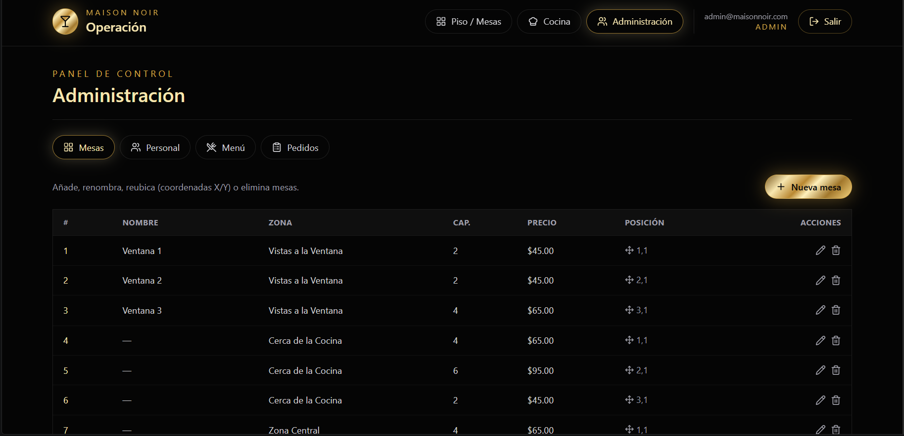

# Maison Noir · Sistema de Operación de Restaurante

[](https://github.com/AlejandroDukesini/Restaurant_reservations/actions/workflows/ci.yml)

Hecho por: Alejandro Rodríguez Duque
Fecha: 10/07/2026
Utilizado con Claude.

Aplicación full‑stack para operar un restaurante: los **meseros** reportan por mesa qué platos se
piden, los **cocineros** ven la cola de cocina con la receta fija de cada plato (proteína,
condimentos, ingredientes) y marcan cada plato como listo, y el **administrador** gestiona mesas,
personal, menú y pedidos.

- **Backend:** Java 21 + Spring Boot 3.5, JPA/Hibernate, PostgreSQL con migraciones Flyway, seguridad JWT (RBAC).
- **Frontend:** React 19 + Vite 8 + Tailwind CSS 4 + React Router 7.
- **Calidad:** 119 pruebas de backend (2 de ellas contra PostgreSQL real) y 57 de frontend en CI. Detalle en [`TESTING.md`](TESTING.md) y
  auditoría en [`QA_AUDIT.md`](QA_AUDIT.md).

---

## Funcionalidades

| Estado | Funcionalidad |
| --- | --- |
| ✅ Implementada (API + UI, con pruebas) | Login JWT con control de acceso por rol · mapa de mesas por zonas · pedidos por mesa con total calculado en el servidor · cola de cocina con receta y estado del pedido derivado de sus platos · CRUD de mesas, menú y personal · aislamiento de datos entre restaurantes |
| ✅ Implementada solo en la API (con pruebas, sin pantalla en el SPA) | Reservas públicas y de cliente con control de aforo y de solapamiento (franjas de 2 h) · mapa de disponibilidad por fecha y hora · registro de clientes · registro de restaurantes |
| ⚠️ Parcial | Generador de sitio web por restaurante: escribe archivos en `generated-websites/`, pero la aplicación no los sirve (ver `QA_AUDIT.md`, QA-FEAT-01) |

## Roles

| Rol                         | Ruta      | Qué puede hacer                                                                                                                                                   |
| --------------------------- | --------- | ----------------------------------------------------------------------------------------------------------------------------------------------------------------- |
| **Administrador** (`ADMIN`) | `/admin`  | CRUD de mesas (incluye mover por coordenadas), personal (meseros y cocineros), menú con receta, y resumen de pedidos.                                             |
| **Mesero** (`EMPLOYEE`)     | `/piso`   | Ver el mapa de mesas y tomar pedidos por mesa eligiendo platos del menú; enviarlos a cocina.                                                                      |
| **Cocinero** (`COOK`)       | `/cocina` | Ver la cola de platos pendientes con su receta y marcar cada plato como _Preparando_ / _Listo_. Al quedar todos los platos listos, el pedido pasa a _Completado_. |
| **Cliente** (`CUSTOMER`)    | (solo API) | Crear, consultar, modificar, confirmar y cancelar sus propias reservas.                                                                                         |

Los platos del menú **no son personalizables**: su receta (proteína, condimentos, ingredientes,
notas de preparación) se define una vez y el cocinero la consulta desde la cola.

---

## Requisitos previos

- **JDK 21** (obligatorio: Gradle 8.6 no funciona con JDK 24/25). Gradle se ejecuta con el wrapper
  incluido (`gradlew` / `gradlew.bat`); no hace falta instalarlo.
- **PostgreSQL 14+** en `localhost:5432` para ejecutar la aplicación. Las pruebas **no** lo necesitan.
- **Node.js** `^22.22.2`, `^24.15.0` o `>=26` (lo exige jsdom 30, usado por las pruebas; campo
  `engines`). El campo `packageManager` fija **pnpm 9.15.9**; Corepack (incluido en Node) lo usa
  automáticamente con `corepack pnpm …` o tras `corepack enable`.

> **Qué se entrega:** una aplicación **web** (SPA React servida por el backend o por Vite) y una API
> REST. El repositorio **no** contiene una PWA (no hay `manifest.webmanifest` ni service worker, así
> que no se puede "instalar" desde el navegador) ni una app **Android**. Una app Android nativa sería un proyecto
> aparte (Kotlin + Android Gradle Plugin) que consumiría esta misma API `/api`.

---

## Descarga e instalación

```bash
# 1. Clonar el repositorio
git clone https://github.com/AlejandroDukesini/Restaurant_reservations.git
cd Restaurant_reservations
```

### 2. Base de datos

Crea la base de datos en PostgreSQL:

```sql
CREATE DATABASE restaurant_reservations;
```

Las credenciales por defecto son `postgres` / `postgres`. Si las tuyas son otras, defínelas con
variables de entorno (ver [Configuración](#configuración-variables-de-entorno)) en lugar de editar
`application.yml`.

El esquema lo crea **Flyway** al arrancar (`src/main/resources/db/migration`) y en el primer
arranque se **siembran datos de demo**: un restaurante, 5 zonas, 16 mesas, 10 platos con receta y
5 usuarios.

#### Migraciones (Flyway) y bases existentes

- **Base vacía:** Flyway ejecuta `V1__baseline_schema.sql`, que reproduce exactamente el esquema
  que creaba `ddl-auto: update` (mismos tipos, restricciones e índices).
- **Base creada antes de Flyway** (con datos): al no encontrar `flyway_schema_history`, Flyway
  registra la versión 1 como *línea base* **sin ejecutar** V1 y sin tocar tablas ni datos
  (`baseline-on-migrate`). Después Hibernate solo **valida** (`ddl-auto: validate`): si el esquema
  no coincide con las entidades, la aplicación no arranca y no modifica nada.
- Antes de adoptar una base de producción, compara su esquema con el de V1:
  `pg_dump --schema-only --no-owner --no-privileges <base>`. Si a la base le falta algo (por
  ejemplo, una versión antigua), arranca una vez la versión anterior de la app con
  `JPA_DDL_AUTO=update` o crea la migración correspondiente; no edites V1.
- Los cambios de esquema futuros van en archivos nuevos `V2__...sql`, `V3__...sql`; nunca se
  modifica una migración ya aplicada. `clean` está deshabilitado.

### 3. Backend (Java / Spring Boot)

Gradle usa el JDK de `JAVA_HOME`, que debe ser un **JDK 21**. Si tu `JAVA_HOME` apunta a otra
versión (p. ej. 25) y no quieres cambiarlo, fija el JDK 21 solo para Gradle en tu archivo de
usuario `~/.gradle/gradle.properties` (no en el del proyecto, que es compartido):

```properties
org.gradle.java.home=C:/Program Files/Java/jdk-21
```

```powershell
# Windows (PowerShell): el prefijo .\ es obligatorio
.\gradlew.bat bootRun
```

```bash
# Linux/macOS
./gradlew bootRun
```

El backend queda en `http://localhost:8081`.

> Se usa el **8081** (y no el 8080) para no chocar con Apache de XAMPP/WAMP, que suele ocupar el 8080. Así puedes dejar XAMPP encendido. Si el 8081 también estuviera ocupado, cambia el puerto con la variable `PORT` y ajusta el proxy de `site_web/vite.config.js`.

### 4. Frontend (React / Vite)

```bash
cd site_web
corepack pnpm install --frozen-lockfile
corepack pnpm dev
```

Abre `http://localhost:5173`. El servidor de Vite hace _proxy_ de `/api` hacia el backend en
`http://localhost:8081`, así que el backend debe estar en marcha.

---

## Build de producción

```bash
# Frontend → site_web/dist/
cd site_web
corepack pnpm build
corepack pnpm preview   # solo para revisar el build en http://127.0.0.1:4173 (no es un servidor de producción)

# Backend → build/libs/restaurant-reservations-1.0.0.jar
./gradlew bootJar       # Windows: .\gradlew.bat bootJar
java -jar build/libs/restaurant-reservations-1.0.0.jar
```

El JAR solo incluye el frontend si `site_web/dist` se copia antes a `src/main/resources/static`; el
`Dockerfile` lo hace automáticamente y es la forma recomendada de generar el artefacto desplegable
(ver [Despliegue](#despliegue)).

---

## Configuración (variables de entorno)

Todas son del backend y opcionales en desarrollo; el frontend no usa variables de entorno. Defínelas
en la terminal, en la configuración de ejecución del IDE o en tu plataforma de despliegue. **No
guardes secretos en el repositorio** (`.env` y `.env.*` están en `.gitignore`).

| Variable | Por defecto | Uso |
| --- | --- | --- |
| `SPRING_DATASOURCE_URL` / `_USERNAME` / `_PASSWORD` | `jdbc:postgresql://localhost:5432/restaurant_reservations`, `postgres`, `postgres` | Conexión a PostgreSQL |
| `JWT_SECRET` | *(vacío)* | Clave HS512 (≥ 64 bytes). Si falta, se genera una clave efímera y los tokens caducan al reiniciar. **Obligatoria en producción.** |
| `JWT_EXPIRATION` | `86400000` (24 h) | Vigencia del token en ms |
| `SEED_ENABLED` / `SEED_PASSWORD` | `true` / `password123` | Siembra de demo. En un despliegue real: `SEED_ENABLED=false` o una contraseña única |
| `JPA_DDL_AUTO` | `validate` | Hibernate valida el esquema; lo crean y evolucionan las migraciones Flyway |
| `FLYWAY_ENABLED` | `true` | Ejecutar las migraciones al arrancar |
| `JPA_SHOW_SQL` | `false` | Mostrar el SQL en el log |
| `PORT` | `8081` | Puerto HTTP (Railway lo inyecta) |
| `COOKIE_SECURE` | `true` | Atributo `Secure` de la cookie de sesión del contenedor |
| `RATE_LIMIT_ENABLED` / `RATE_LIMIT_LOGIN` / `RATE_LIMIT_PUBLIC` | `true` / `10` / `20` | Peticiones POST por minuto e IP en `/api/auth/**` y `/api/public/**` |
| `APP_RATE_LIMIT_TRUST_FORWARDED_HEADER` | `true` | Tomar la IP del cliente de `X-Forwarded-For` |
| `APP_CORS_ALLOWED_ORIGIN_PATTERNS` | `http://localhost:*,http://127.0.0.1:*` | Orígenes CORS permitidos (separados por comas) |
| `LOG_LEVEL_SECURITY` | `INFO` | Nivel de log de Spring Security |

---

## Cuentas de demostración

Las crea la siembra con la contraseña **`password123`** (o la que definas en `SEED_PASSWORD`):

| Rol           | Correo                                              |
| ------------- | --------------------------------------------------- |
| Administrador | `admin@maisonnoir.com`                              |
| Mesero        | `mesero1@maisonnoir.com` · `mesero2@maisonnoir.com` |
| Cocinero      | `cocina1@maisonnoir.com` · `cocina2@maisonnoir.com` |

En la pantalla de login hay botones para rellenar estas credenciales rápidamente.

---

## Pruebas y calidad

```powershell
# Backend: no necesita PostgreSQL (usa H2 en memoria). Genera cobertura JaCoCo.
.\gradlew.bat test
```

```bash
# Frontend
cd site_web
pnpm test              # Vitest + Testing Library
pnpm test:coverage     # con cobertura
```

Última ejecución verificada (local, 2026-10-04):

| Suite | Resultado | Cobertura de líneas | Cobertura de ramas |
| --- | --- | --- | --- |
| Backend (JUnit 5 + MockMvc + H2) | 115 aprobadas · 0 fallidas | 97.1 % | 69.8 % |
| Frontend (Vitest + Testing Library) | 44 aprobadas · 0 fallidas | 53.1 % | 54.3 % |


Qué se prueba: autenticación JWT, control de acceso por rol, aislamiento entre restaurantes,
reglas de reservas (aforo y solapamiento), flujo pedido → cocina → pedido completado, CRUD de
administración, cabeceras de seguridad, CORS, limitador de peticiones, protección XSS y path
traversal del generador de sitios, y la UI del login, el piso y la cocina. Estrategia, matriz de
trazabilidad y limitaciones en [`TESTING.md`](TESTING.md).

### Integración continua

[`.github/workflows/ci.yml`](.github/workflows/ci.yml) se ejecuta en cada `push` a `Principal`, `Beta` o
`main` y en cada pull request:

1. **Backend**: JDK 21 + wrapper de Gradle 8.6 → `./gradlew build` (compilación, pruebas y JaCoCo). Publica los
   reportes como artefactos.
2. **Frontend**: Node 24 + pnpm 9.15.9 (de `packageManager`) → `pnpm install --frozen-lockfile`, pruebas con cobertura y build
   de producción.
3. **Docker**: construye la imagen de despliegue (no se publica).

Cualquier fallo detiene el pipeline. Permisos de solo lectura, sin secretos.

---

## Despliegue

El `Dockerfile` multi-etapa compila el frontend (pnpm 9), lo incrusta en el JAR de Spring Boot y
ejecuta la aplicación como usuario sin privilegios sobre `eclipse-temurin:21-jre-alpine`. Front y
API comparten origen.

```bash
docker build -t restaurant-reservations .
docker run -p 8081:8081 \
  -e SPRING_DATASOURCE_URL=jdbc:postgresql://host.docker.internal:5432/restaurant_reservations \
  -e JWT_SECRET='<clave de al menos 64 bytes>' \
  -e SEED_ENABLED=false \
  restaurant-reservations
```

En Railway, `railway.toml` construye con ese Dockerfile; define allí las variables anteriores.

---

## Solución de problemas

- **`Port 8081 was already in use`**: define `PORT` con un puerto libre y actualiza el destino del
  proxy en `site_web/vite.config.js` para que coincida.
- **`Java home ... is invalid`, `Unsupported class file major version` o Gradle falla al
  arrancar**: Gradle se está ejecutando con un JDK distinto de 21. Comprueba con
  `./gradlew --version` (línea *Launcher/Daemon JVM*) y apunta `JAVA_HOME` o
  `org.gradle.java.home` (en `~/.gradle/gradle.properties`) a un JDK 21.
- **`./gradlew: Permission denied`** (Linux/macOS): `chmod +x gradlew`.
- **`Connection to localhost:5432 refused`** al arrancar el backend: PostgreSQL no está en marcha o
  la base `restaurant_reservations` no existe (ver [Base de datos](#2-base-de-datos)).
- **`ERR_PNPM_UNSUPPORTED_ENGINE` o fallos de jsdom al ejecutar las pruebas**: tu Node.js está fuera
  del rango de `engines`; usa Node 22.22.2+ o 24.15+ (`node -v`).
- **`violates check constraint "users_role_check"`**: tu base de datos viene de una versión anterior
  sin el rol `COOK`. Elimina el constraint obsoleto (una sola vez):
  `ALTER TABLE users DROP CONSTRAINT IF EXISTS users_role_check;`
  o recrea la base de datos vacía.
- **`ERR_PNPM_VIRTUAL_STORE_DIR_MAX_LENGTH_DIFF`** al instalar el frontend: el `node_modules`
  existente lo creó otra versión de pnpm (o está incompleto y `vite`/`vitest` no se encuentran).
  Borra `site_web/node_modules` y vuelve a ejecutar `corepack pnpm install --frozen-lockfile`.

---

## Estructura del proyecto

```
reservas/
├── .github/workflows/ci.yml      # Pipeline de CI (backend, frontend, Docker)
├── src/main/java/com/restaurant/reservations/
│   ├── controller/   # Controladores REST y manejo global de errores
│   ├── dto/          # Objetos de transferencia con validación
│   ├── model/        # Entidades (User, Restaurant, Zone, Table, Order, OrderItem, MenuItem, Reservation)
│   ├── repository/   # Repositorios JPA
│   ├── security/     # JWT, filtro de autenticación, limitador de peticiones, configuración
│   ├── service/      # Lógica de negocio
│   └── config/       # DataSeeder (datos de demo), CORS, servido del SPA
├── src/main/resources/application.yml
├── src/main/resources/db/migration/   # Migraciones Flyway (V1 = esquema base)
├── src/test/
│   ├── java/.../     # Pruebas unitarias y de integración (JUnit 5 + MockMvc)
│   └── resources/application-test.yml   # Perfil de pruebas (H2, sin siembra)
├── site_web/         # Frontend React (Vite + Tailwind)
│   ├── src/
│   │   ├── api/          # Cliente HTTP y módulos por recurso
│   │   ├── auth/         # Contexto de autenticación (JWT)
│   │   ├── components/   # UI reutilizable y paneles de admin
│   │   ├── pages/        # Login, Piso, Cocina, Administración
│   │   ├── utils/
│   │   └── **/*.test.*   # Pruebas de Vitest junto al código
│   └── vitest.config.js
├── perf/             # Prueba de carga k6 y metodología de medición
├── Dockerfile        # Build multi-etapa (frontend + backend) para despliegue
├── railway.toml
├── build.gradle.kts
├── gradlew, gradlew.bat  # Wrapper de Gradle 8.6
├── QA_AUDIT.md           # Auditoría técnica, defectos y riesgos
├── TESTING.md            # Estrategia de pruebas, comandos y trazabilidad
└── README.md
```

---

## Principales endpoints de la API

| Método              | Ruta                                             | Rol                  | Descripción                              |
| ------------------- | ------------------------------------------------ | -------------------- | ---------------------------------------- |
| POST                | `/api/auth/login`                                | público              | Iniciar sesión, devuelve el JWT          |
| POST                | `/api/auth/register`                             | público              | Alta de cliente (siempre rol `CUSTOMER`) |
| GET                 | `/api/public/restaurants[/{slug}[/tables]]`      | público              | Restaurantes activos y sus mesas         |
| GET                 | `/api/public/restaurants/{id}/table-map?date=&time=` | público          | Disponibilidad de mesas por franja       |
| POST                | `/api/public/reservations`                       | público              | Reserva sin cuenta (queda confirmada)    |
| GET/POST/PUT/DELETE | `/api/customer/reservations[/{id}]`              | cliente/mesero/admin | Reservas propias (o del restaurante, para el personal) |
| PUT                 | `/api/customer/reservations/{id}/confirm`·`/cancel` | cliente/mesero/admin | Confirmar o cancelar                  |
| GET                 | `/api/staff/tables`                              | staff                | Mesas del restaurante                    |
| GET                 | `/api/staff/menu`                                | staff                | Menú con receta                          |
| POST                | `/api/employee/orders`                           | mesero/admin         | Crear pedido para una mesa               |
| GET                 | `/api/employee/tables/{id}/orders`               | mesero/admin         | Pedidos de una mesa                      |
| PUT/DELETE          | `/api/employee/orders/{id}[/status]`             | autor/admin          | Cambiar estado o eliminar un pedido      |
| GET                 | `/api/cook/queue`                                | cocinero/admin       | Cola de platos por preparar (con receta) |
| PUT                 | `/api/cook/order-items/{id}/status?status=READY` | cocinero/admin       | Marcar plato listo                       |
| GET/POST/PUT/DELETE | `/api/admin/staff[/{id}]`                        | admin                | CRUD de personal                         |
| GET/POST/PUT/DELETE | `/api/admin/menu[/{id}]`                         | admin                | CRUD de menú                             |
| POST/PUT/DELETE     | `/api/employee/tables[/{id}]`                    | admin/mesero         | Crear, mover y eliminar mesas            |
| GET                 | `/api/admin/orders`                              | admin                | Todos los pedidos                        |
| POST/GET/PUT/DELETE | `/api/admin/restaurants[/register\|/{id}]`       | admin                | Alta y gestión del restaurante propio    |

Los errores que gestionan los controladores usan el formato JSON
`{ "status", "error", "message", "details" }`. Los 401/403 que emite directamente la cadena de
filtros de seguridad usan el formato de error por defecto de Spring Boot.

---

## Seguridad

Controles implementados y cubiertos por pruebas:

- Autenticación con **JWT HS512**, sin sesión en el servidor. La clave se toma de `JWT_SECRET`; si
  mide menos de 64 bytes, la primera emisión o validación de un token falla (no hay fallback a una
  clave débil).
- Control de acceso por rol en dos capas (rutas y `@PreAuthorize`) y **aislamiento entre
  restaurantes** en los servicios. A un recurso de otro restaurante se responde 404 para no revelar
  que existe.
- Contraseñas con **BCrypt (coste 12)**, mínimo 12 caracteres. El registro público nunca acepta el
  rol desde el cliente.
- Login con respuesta idéntica para usuario inexistente y contraseña incorrecta (no permite
  enumerar cuentas). Limitador de peticiones por IP en login y endpoints públicos.
- Cabeceras CSP, `X-Frame-Options: DENY`, HSTS, `Referrer-Policy`, `Permissions-Policy` y COOP.
  CORS restringido a orígenes configurados.
- Errores sin trazas ni mensajes internos (identificador de correlación en los 500). Escape HTML/JS
  y protección contra path traversal en el generador de sitios.

- Dar de baja a un usuario revoca sus tokens al instante. Los paneles de administración solo
  muestran datos del restaurante propio.

**Riesgos conocidos pendientes** (detalle y propuesta en [`QA_AUDIT.md`](QA_AUDIT.md)): el limitador
confía en `X-Forwarded-For` (QA-SEC-03) y la siembra de demo usa una contraseña conocida si no se
configura `SEED_PASSWORD` / `SEED_ENABLED` (QA-SEC-04).

---

## Limitaciones conocidas

- La gestión de reservas está en el panel de administración (pestaña *Reservas*); el mesero no
  tiene vista de reservas porque la API no expone un listado por restaurante para ese rol.
- Los estados de pedido y reserva se guardan como ordinal (QA-DATA-01).
- Las pruebas de integración usan H2; las migraciones se prueban contra PostgreSQL real solo si se
  define `TEST_POSTGRES_URL` (CI lo hace con un servicio PostgreSQL). No hay pruebas E2E en navegador.

---

## Performance & Scalability

> Cifras medidas por el autor con la metodología y los comandos de [`perf/README.md`](perf/README.md).
> No se volvieron a ejecutar en la auditoría de QA del 2026-10-04.

### Backend · eliminación de N+1 en el endpoint más pesado

El endpoint crítico es `GET /api/cook/queue`, que agrega todos los platos pendientes de los
pedidos activos con su receta, mesa y mesero. La consulta original traía solo los `Order` y
disparaba carga *lazy* de cada relación (problema **N+1**). Se reescribió
`OrderRepository.findActiveByRestaurant` con `JOIN FETCH` para resolver todo en una sola consulta.

Medido con **k6** sobre una cola de **450 platos** (150 pedidos activos), 20 usuarios concurrentes:

| Métrica                     |  Antes (N+1) | Después (`JOIN FETCH`) |    Mejora |
| --------------------------- | -----------: | ---------------------: | --------: |
| **Consultas SQL / request** |      **157** |                  **3** | **98 % ↓** |
| Throughput (RPS)            |         2.82 |                   ~52  | **18× ↑** |
| Latencia media              |       5.53 s |                 309 ms |   94 % ↓  |
| Latencia **p95**            |       8.77 s |                 767 ms |   91 % ↓  |
| Latencia **p99**            |       9.13 s |                 1.24 s |   86 % ↓  |
| Tasa de éxito               |         100% |                   100% |     —     |

Apoyado en el **pool de conexiones HikariCP** de Spring Boot y en el *fetching* en un solo viaje
a la base de datos, en lugar de cientos de round-trips por petición.

### Frontend · Google Lighthouse (build de producción)

| Categoría      | 📱 Móvil | 🖥️ Escritorio |
| -------------- | :------: | :------------: |
| Performance    |  97–99   |    **100**     |
| Accessibility  | **100**  |    **100**     |
| Best Practices | **100**  |    **100**     |
| SEO            | **100**  |    **100**     |

**Core Web Vitals:** LCP **1.7 s** (móvil) / **0.4 s** (escritorio) · TBT ≤ **140 ms** · CLS **0**.

Logrado con: build de Vite con *code-splitting*, *tree-shaking* y minificación; CSS purgado por
Tailwind (bundle único y liviano); contraste AA en toda la UI; favicon SVG y metadatos
(`meta description` + `robots.txt`) para 100 en Best Practices y SEO. CLS 0 = cero saltos de layout.

### Cómo reproducirlo

```bash
# Frontend
cd site_web && corepack pnpm build && corepack pnpm preview
npx lighthouse http://127.0.0.1:4173/ --preset=desktop

# Backend (con la base sembrada, ver perf/README.md)
k6 run perf/cook-queue-load.js
```

## Licencia

Copyright © 2026. Todos los derechos reservados.
